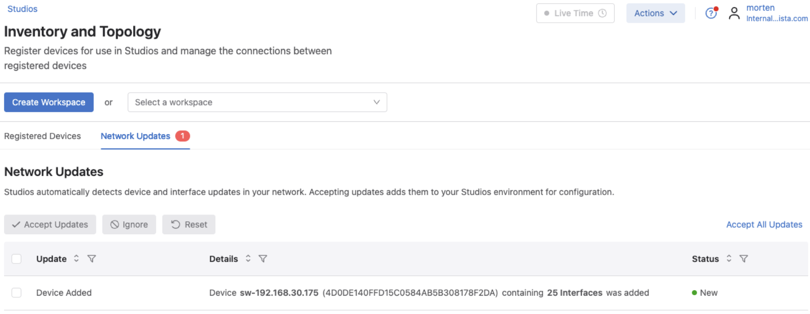
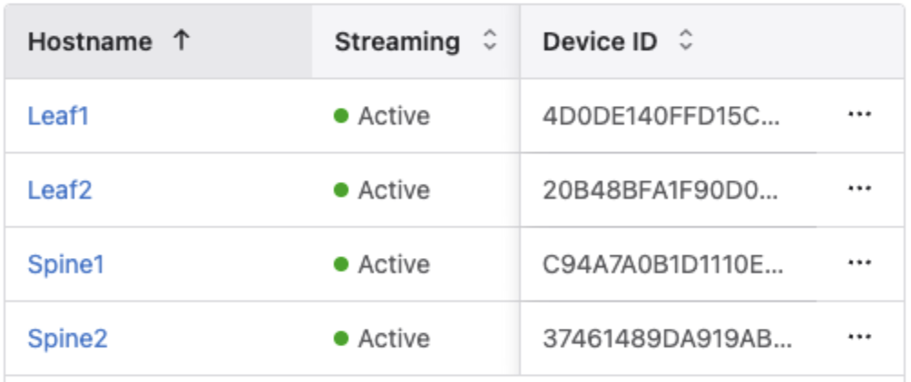

# Arista Southwest Region Newsletter

Welcome to the February 2026 Newsletter for Arista customers in the U.S. Southwest Region! 

We welcome your feedback on the newsletter. If you have any ideas or suggestions on how to improve the newsletter, please reach out to [southwest@arista.com](mailto:southwest@arista.com){: target="_blank" }.  

---

## Leadership Perspectives — Recent Blogs from Arista Leadership

-   **Delivering Reliable AI and Cloud Networking**
    ---
    *Dec 18, 2025: Hugh Holbrook and Kamal Sharma explore the infrastructure requirements for massive-scale GenAI.*
    
    [Read Blog](https://blogs.arista.com/blog/delivering-reliable-ai-and-cloud-networking){: target="_blank" }

-   **The Cognitive Campus Blueprint**
    ---
    *Dec 10, 2025: A guide to navigating the "all-wireless office" transformation with AI-driven operations.*
    
    [Read Blog](https://blogs.arista.com/blog/cognitive-campus-blueprint){: target="_blank" }

[Explore All Blogs](https://blogs.arista.com/blog){: target="_blank" }

---

## Southwest Region Tech Tip of the Month

!!! info "The 'Audit' Without the Effort: CloudVision Compliance Dashboard"
    

    After onboarding your devices via ZTP, use the **Compliance Dashboard** in CloudVision to proactively monitor for "Configuration Drift" — the unauthorized or accidental changes made directly to the CLI of a switch.
    
    **Why it matters:** In a large fabric, a single manual change can create a mismatch between your "Designed" state, as created in CloudVision, and the "Running" state. CloudVision uses continuous real-time streaming telemetry to identify these gaps, highlighting exactly which lines of code are out of sync.
    
    **Pro Tip:** Enable **Compliance Alerts** to receive an immediate notification via email or Slack the moment a device falls out of compliance, allowing you to remediate the drift using a Change Control before it impacts production stability. The same alerts can also be set up for other compliance information found in the Compliance Dashboard, such as CVEs, Bugs, and End of Life information. 
    

  

---
## Featured Article

### The Ease of Device Onboarding and Replacement Using Arista CloudVision Studios
By: Morten Sefeld, Systems Engineer 
 

**An article in two parts.**
Tasks such as onboarding a new device or replacing an existing device in a networking fabric should be simple and trivial, yet they remain complex in far too many organizations today. Touching the network is traditionally looked at as a necessary evil—invasive and complex—that introduces risk, forcing many organizations to hire expensive outside consultants to perform these tasks. 

In this article we will talk about how to safely and easily onboard and replace an Arista device using Arista CloudVision as a Service (CVaaS) Zero Touch Provisioning (ZTP) and Zero Touch Replacement (ZTR) Studios. No copying of configurations to text-files, USB sticks, or external consultants necessary. CloudVision Studios truly make these tasks as safe and simple as zero touch.

 
**Part Two - Device Replacement**

Zero Touch Replacement is a CloudVision feature that enables the network administrator to easily and safely replace network devices, such as Arista switches and routers in the network or network fabric, while maintaining all configurations and  automation relationships in CloudVision. 
ZTR utilizes the ZTP process described in part one of this article. If your device supports ZTP and has been provisioned in CloudVision - it also supports ZTR.

 
**Process**

After the replacement device has been successfully installed, cabled and onboarded using ZTP it will appear in CloudVision Studios “Network Updates” under Inventory and Topology Studio, and in the general CloudVision Inventory, where it will remain unconfigured in ZTP mode until a designed configuration has been assigned to the device.

<figure markdown="span">
  
  <figcaption>CloudVision Studios - Inventory and Topology View</figcaption>
</figure>  

 

The full configuration, automation tags, device role etc will be delivered to the device  as a part of the ZTR process, where the replacement device will assume the identity from the device it is replacing. CloudVision will update itself accordingly with the new device’s information such as serial number, device ID, etc.

In this example we want to replace ‘Leaf1’ with the device currently known as ‘sw-192.168.30.175’, as you can see in the device inventory below.

 

<figure markdown="span">
  
  <figcaption>CloudVision - Device Inventory List</figcaption>
</figure>  

The ZTR process is initiated from Registered Devices under the  Inventory and Topology Studio. Simply select the device you want to replace, choose the replacement from the drop down menu of available unconfigured replacement devices, and begin the replacement.

 

<figure markdown="span">
  
  <figcaption>CloudVision Studios - Inventory and Topology Studio, Replace Device </figcaption>
</figure> 

A CloudVision workspace is automatically created and the change control initiated. After a careful review you can submit the change control for validation and approval.  Additionally, replacement devices will inherit any existing image bundle assigned to the original device.  

 

<figure markdown="span">
  
  <figcaption>CloudVision Studios - Workspace Review </figcaption>
</figure> 

In this example 149 lines of configuration are pushed to the device, 3 lines untouched, and 285 lines removed - mostly default ZTP configuration.

 

<figure markdown="span">
  
  <figcaption>CloudVision - Change Control </figcaption>
</figure> 

After successfully completing the  change control stages, ‘sw-192.168.30.175’ is now ‘Leaf1’, it is active, alive, and streaming real-time telemetry to CVaaS. 

 

<figure markdown="span">
  
  <figcaption>CloudVision - Updated Inventory </figcaption>
</figure> 

Notice the Device ID for ‘Leaf1’ is the same as the switch formerly known as  ‘sw-192.168.30.175’. 

The ZTR process has completed, and the old device can now be decommissioned.

 

For more information and requirements on ZTR, click on the link below.

* [Replacing Devices in CloudVision Studios](https://www.arista.io/help/articles/provisioning-studios-built-in-inventory#cHJvdmlzaW9uaW5nLnN0dWRpby9UT1BPTE9HWQ==-replacing-devices){ target="_blank" }

 

---

## __*Upcoming Events*__  
Arista hosts various events throughout the year for you! Members of our team organize these informative events to showcase Arista's ability to not only help improve your network, but to also assist by providing a set of tools to improve your operations!  

Click on the boxes below to be directed to Arista's website for additional lists of Webinars and Events.

-   __Webinars__  

    --- 

    We make it easy for you to view products that are of interest, all virtually! Technical members of the team showcase outstanding explanations of the products. Click below to see our list of Webinars. 

    [Arista Webinars](https://www.arista.com/en/company/news/webinars){.md-button target="_blank"}

-   __Events__ 

    ---
    Join us in person to get a closer look at our list of products and solutions, as well as get the chance to meet members of the team. Click below to see our list of upcoming Events. 

    [Upcoming Events](https://www.arista.com/en/company/news/events){ .md-button target="_blank" }

--- 

## __*Software Updates*__

*Stay informed on the latest software updates across all Arista products and services.*

|  Software    | Version      |  Release Date |
| :-----------: | :-----------: | :-----------: |
| __EOS__           | 4.33.4.1M   4.32.9M   4.35.1F   4.31.10M   4.34.4M | January 7th, 2026   January 2nd, 2026   December 16th, 2025   December 12th, 2025   December 3rd, 2025 |
| __CVP__           | Portal 2025.3.1   Appliance 7.1.0   Sensor 1.3.0 | December 17th, 2025   September 2nd, 2025   December 5th, 2025 |
| __DMF__           | 8.8.0 | August 15th, 2025 |
| __CV-CUE__         | 21.0.0 | January 16th, 2026 |
| __Arista NDR__     | 5.3.5 | July 16th, 2025 |
| __TerminAttr__     | 1.42.1 | February 4th, 2026 |
| __VeloCloud SD-WAN__  Orchestrator/Gateway/Edge | 6.4.1 | December 19th, 2025 |

[View All Latest Software Updates](https://www.arista.com/en/support/software-download){: .md-button .md-button--primary target="_blank" }

---

## __* Security Advisories and Field Notices*__

*Stay informed on the latest platform security and field notice updates.*

### **Security Advisories**
* **ETM NGFW** — [Security Advisory 0133](https://www.arista.com/en/support/advisories-notices/security-advisory/23399-security-advisory-0133){: target="_blank" }   *(February 3rd, 2026)*

### **Field Notices**
* **CV-CUE: Depreciation of IAPC via Wireless Manager** — [Field Notice 0124](https://www.arista.com/en/support/advisories-notices/field-notice/23398-field-notice-0124){: target="_blank" }   *(February 3rd, 2026)*
* **CV-CUE: Depreciation of Probed SSID** — [Field Notice 0123](https://www.arista.com/en/support/advisories-notices/field-notice/23397-field-notice-0123){: target="_blank" }   *(February 3rd, 2026)*

 

[View All Latest Advisories & Notices](https://www.arista.com/en/support/advisories-notices){: .md-button .md-button--primary target="_blank" }

---

## __* Product Updates*__

*Stay up to date on all new Arista Product Releases, as well as End of Sale/End of Support Notices.*

### **New Product Releases** 
* **Q3 2025** — [VeloCloud Acquisition](https://www.arista.com/en/company/news/press-release/21646-pr-07012025){: target="_blank" }

###  **End of Sale / End of Software Support**
* **February 2nd, 2026** — [CloudVision Portal 2024.2](https://www.arista.com/en/support/advisories-notices/end-of-support/23396-end-of-software-support-for-cloudvision-portal-2024-2-release-train){: target="_blank" } 

 

[View All Latest End of Sale & Support Notices](https://www.arista.com/en/support/advisories-notices/endofsale){: .md-button .md-button--primary target="_blank" }

---

## Have you heard? 
Arista has revamped their certifications! The new **Arista Certified Engineer (ACE)** program is now organized by specific tracks like Cloud Data Center, Campus, and Automation to better align with your job role.

[Start your ACE journey now](https://www.training.arista.com/){ .md-button .md-button--primary target="_blank" }

---

---
## *Your Southwest Regional Team is Here to Support Your Success.* 

---

  <h3 style="color: #004a99; margin-top: 0;">Let's Connect</h3>
  
Thanks for reading! Your local Arista team is here to help you navigate your evolving network needs. Reach out anytime to southwest@arista.com for more information or technical guidance. Until next month—stay connected!

  <a href="mailto:southwest@arista.com" class="md-button md-button--primary">Contact Your Local Team</a>

