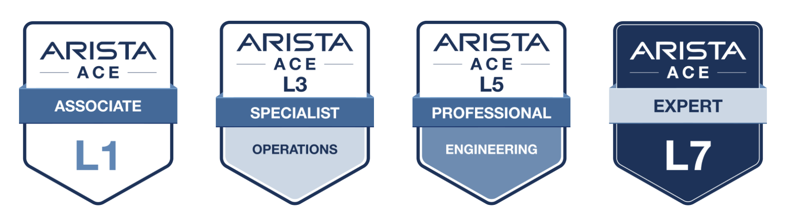

# Arista Southwest Region Newsletter

Welcome to the January 2026 Newsletter for Arista customers in the U.S. Southwest Region! 

We welcome your feedback on the newsletter. If you have any ideas or suggestions on how to improve the newsletter, please reach out to [southwest@arista.com](mailto:southwest@arista.com){: target="_blank" }.  

---

## Leadership Perspectives — Recent Blogs from Arista Leadership

<div class="grid cards" markdown>

-   **Delivering Reliable AI and Cloud Networking**
    ---
    *Dec 18, 2025: Hugh Holbrook and Kamal Sharma explore the infrastructure requirements for massive-scale GenAI.*
    
    [Read Blog](https://blogs.arista.com/blog/delivering-reliable-ai-and-cloud-networking){: target="_blank" }

-   **The Cognitive Campus Blueprint**
    ---
    *Dec 10, 2025: A guide to navigating the "all-wireless office" transformation with AI-driven operations.*
    
    [Read Blog](https://blogs.arista.com/blog/cognitive-campus-blueprint){: target="_blank" }

</div>

[Explore All Blogs](https://blogs.arista.com/blog){: target="_blank" }


---


## Southwest Region Tech Tip of the Month

!!! info "The 'Pre-Game' Safety Net: CloudVision Snapshots"
    <div style="font-size: 1.15em; line-height: 1.5;" markdown>
    Before pushing a major config change to your network, integrate a **CloudVision Snapshot** into your change control workflow to capture the exact state of your routing tables and interface counters before and after the change is executed.
    
    **Why it matters:** If things go sideways, you aren't just looking at logs—you can "diff" the network state between the two snapshots to see exactly which routes dropped, if any, further simplifying complex changes.
    
    **Pro Tip:** Pair this with CloudVision Change Control Rollbacks, which allow you to revert to the previous state prior to the change, for a 100% stress-free maintenance window. 
    </div>
  

---
## Featured Article

### The Ease of Device Onboarding and Replacement Using Arista CloudVision Studios
By: Morten Sefeld, Systems Engineer 
<br>

**An article in two parts.**
Tasks, such as, onboarding a new device or replacing an existing device in a networking fabric should be simple and trivial tasks, except it is not in far too many organizations today. Touching the network is traditionally looked at as a necessary evil, invasive and complex, that introduces risk and potential outages, forcing many organizations to hire expensive outside consultants to perform these tasks, among others. 

In this article we will talk about how to safely and easily onboard and replace an Arista device using Arista CloudVision as a Service (CVaaS) Zero Touch Provisioning (ZTP) and Zero Touch Replacement (ZTR) Studios. No copying of configurations to text-files, USB sticks, or external consultants necessary. CloudVision Studios truly make these tasks as safe and simple as zero touch.


<br>
**Part One - Device Provisioning**

Zero Touch Provisioning is an automation feature enabling network devices, such as Arista switches and routers to automatically onboard into CloudVision and to configure themselves after they are connected to the network. 
Arista switches and routers support multiple ways of ZTP onboarding, but this article will focus on the latest version utilizing the embedded hardware enrollment token present on all Arista devices shipped after September 2020 running EOS 4.26.1 or later. 
Please note – should you have devices without the embedded enrollment token, you can    create one in CVaaS, copy it to your device, and add DHCP option 67 (https://www.arista.io/ztp/bootstrap) to your DHCP server. This will allow you to follow the same onboarding process.


<br>
**Components**

* Arista device with embedded enrollment token
* CloudVision as a Service
* DHCP server providing a management IP address, a gateway address, DNS and NTP services  

<br>
**Process**

All new Arista switches and routers shipped, as well as any devices without a startup config present, automatically enters ZTP mode at boot. This enables the device to obtain an IP address through any front facing or management interface and to connect and self-register to your organization's CVaaS instance. You simply connect it to the network.
After receiving a DHCP address and connecting to CVaaS at www.arista.io, the automated onboarding process will begin.


<figure markdown="span">
  
  <figcaption>Zero Touch Provisioning - Process Illustration</figcaption>
</figure>  

Your new switch or router will stay connected to CVaaS in ZTP mode until it has been onboarded and a boot-file configuration has been received. Once received the system will apply that configuration as startup-config, exit ZTP mode and restart. The system is now onboarded to studios and fully configured with the designed configuration.

<br>

**Let’s take a look**

The following console outputs are grabbed from a freshly booted CCS-710P-16P entering ZTP mode. It sends DHCP requests from all front-facing and management interfaces.  

```text
No startup-config was found.

The device is in Zero Touch Provisioning mode and is attempting to 
download the startup-config from a remote system. The device will not 
be fully functional until either a valid startup-config is downloaded 
from a remote system or Zero Touch Provisioning is cancelled.
```

<br>
The 710P then receives a DHCP IP address, and immediately connects to apiserver.arista.io, where it is directed to the CVaaS cluster hosting your organization

```text
...
%ZTP-6-INIT: No startup-config found, starting Zero Touch Provisioning
...
%ZTP-6-DHCPv4_QUERY: Sending DHCPv4 request with system MAC address on [ Ethernet18 ] (option 67, 143)
%ZTP-6-DHCPv4_SUCCESS: DHCPv4 response received on Ethernet18 [ Ip Address: 192.168.10.76/24; Nameserver: 9.9.9.9; Domain: sefeld.dk; Gateway: 192.168.10.1; NTP Serve)
%ZTP-6-CLOCK_SYNC_SUCCESS: Successfully synchronized the device clock using NTP
%ZTP-6-CLOUDVISION_ENROLLMENT_START: Attempting enrollment into CloudVision at endpoint: apiserver.arista.io:443
...
%ZTP-6-CLOUDVISION_REDIRECTOR_SUCCESS: Cluster assignment from CloudVision Redirector service successful: https://www.cv-prod-us-central1-c.arista.io
%ZTP-6-CLOUDVISION_ENROLLMENT_SUCCESS: Successfully enrolled switch into CloudVision
...
```

<br>
After enrollment and registration in CVaaS Studios inventory it is identified by an automatically given host name (sw-192.168.10.76) based on the DHCP IP, and its serial number (WTW24520453). After assigning the designed configuration to the device, you will see it show up as out of compliance. 

<br>

<figure markdown="span">
  
  <figcaption>Device Config Out of Compliance - CloudVision Example</figcaption>
</figure>  

<br>

This is because CVaaS and the EOS real-time streaming telemetry daemon compares the running config on the physical device with the designed configuration, which is mismatched. We need to make a change control and sync the device with the designed config in CVaaS.

<br>

<figure markdown="span">
  { width="800" }
  <figcaption>Successful Change Control - CloudVision Example</figcaption>
</figure>

<br>

As shown in the above screenshot, CVaaS has added 138 lines of configuration (green), removed 263(red), mostly default ZTP configuration, and modified 2 existing lines(blue). Notice the devices name changed to the configured hostname (710P-16P) as well. 

<br>

```text
....
%ZTP-6-CONFIG_DOWNLOAD: Attempting to download the startup-config from https://www.cv-prod-us-central1-c.arista.io/ztp/bootstrap
%ZTP-6-CONFIG_DOWNLOAD_SUCCESS: Successfully downloaded config script from https://www.cv-prod-us-central1-c.arista.io/ztp/bootstrap
%ZTP-6-EXEC_SCRIPT: Executing the downloaded config script
...
```

<br>

The above image shows that the 710P-16P has successfully received its config script and new designed configuration. It will apply the new configuration and restart.  
The device is back, and shows as compliant and active in CVaaS inventory

<figure markdown="span">
  
  <figcaption>Device in Compliance - CloudVision Example</figcaption>
</figure>  


Please keep an eye out for Part Two of this article - replacing a device using the ZTP Studio in CVaaS.

<br>

For more information and requirements on ZTP and ZTR click on the links below.

* [Devices supported with Embedded token](https://www.arista.com/assets/data/pdf/platform_specific_feature_set_guide.pdf){ target="_blank" }
* [ZTP using an Embedded Token](https://arista.my.site.com/AristaCommunity/s/article/Zero-Touch-Provisioning-using){ target="_blank" }


 


---

## __*Upcoming Events*__  
Arista hosts various events throughout the year for you! Members of our team organize these informative events to showcase Arista's ability to not only help improve your network, but to also assist by providing a set of tools to improve your operations!  

Click on the boxes below to be directed to Arista's website for additional lists of Webinars and Events.


<div class="grid cards" markdown>

-   __Webinars__  

    --- 

    We make it easy for you to view products that are of interest, all virtually! Technical members of the team showcase outstanding explanations of the products. Click below to see our list of Webinars. 

    [Arista Webinars](https://www.arista.com/en/company/news/webinars){.md-button target="_blank"}

-   __Events__ 

    ---
    Join us in person to get a closer look at our list of products and solutions, as well as get the chance to meet members of the team. Click below to see our list of upcoming Events. 

    [Upcoming Events](https://www.arista.com/en/company/news/events){ .md-button target="_blank" }


</div>

--- 

## __*Software Updates*__


*Stay informed on the latest software updates across all Arista products and services.*

|  Software    | Version      |  Release Date |
| :-----------: | :-----------: | :-----------:
| __EOS__           | 4.33.4.1M <br> 4.32.9M <br> 4.35.1F <br> 4.31.10M <br> 4.34.4M | January 7th, 2026 <br> January 2nd, 2026 <br> December 16th, 2025 <br> December 12th, 2025 <br> December 3rd, 2025
| __CVP__           | Portal 2025.3.1 <br> Appliance 7.1.0 <br> Sensor 1.3.0 <br>    | December 17th, 2025 <br> September 2nd, 2025 <br> December 5th, 2025 <br>
| __DMF__           | 8.8.0 <br >| August 15th, 2025 <br> 
| __CV-CUE__  |  20.0.0 <br>      |  August 20th, 2025<br>  
| __Arista NDR__         | 5.3.5         | July 16th, 2025
| __TerminAttr__    | 1.41.1 <br>       | December 15th, 2025 <br>  
| __VeloCloud SD-WAN__  <br>Orchestrator/ Gateway / Edge<br>  | <br>6.4.1 <br>       | <br> December 19th, 2025 <br>

[View All Latest Software Updates](https://www.arista.com/en/support/software-download){: .md-button .md-button--primary target="_blank" }


---

## __* Security Advisories and Field Notices*__


*Stay informed on the latest platform security and field notice updates.*


### **Security Advisories**
* **MACsec** — [Security Advisory 0132](https://www.arista.com/en/support/advisories-notices/security-advisory/0132){: target="_blank" } <br> *(December 30th, 2025)*
* **VeloCloud** — [Security Advisories 0131](https://www.arista.com/en/support/advisories-notices/security-advisory/23119-security-advisory-0131){: target="_blank" }, [0130](https://www.arista.com/en/support/advisories-notices/security-advisory/23118-security-advisory-0130){: target="_blank" }, [0129](https://www.arista.com/en/support/advisories-notices/security-advisory/23117-security-advisory-0129){: target="_blank" } <br> *(December 23rd, 2025)*
* **OSPFv3** — [Security Advisory 0128](https://www.arista.com/en/support/advisories-notices/security-advisory/23115-security-advisory-0128){: target="_blank" } <br> *(December 16th, 2025)*

### **Field Notices**
* **Unavailable Line Cards** — [Field Notice 0120](https://www.arista.com/en/support/advisories-notices/field-notice/23042-field-notice-0120){: target="_blank" } <br> *(December 10th, 2025)*
* **On-Prem CloudVision Upgrade** — [Field Notice 0119](https://www.arista.com/en/support/advisories-notices/field-notice/22964-field-notice-0119){: target="_blank" } <br> *(December 2nd, 2025)*


[View All Latest Advisories & Notices](https://www.arista.com/en/support/advisories-notices){: .md-button .md-button--primary target="_blank" }

---

## __* Product Updates*__


*Stay up to date on all new Arista Product Releases, as well as End of Sale/End of Support Notices.*


### **New Product Releases** 
* **Q3 2025** — [VeloCloud Acquisition](https://www.arista.com/en/company/news/press-release/21646-pr-07012025){: target="_blank" }


###  **End of Sale / End of Software Support**
* **Nov 5th, 2025** — [ETM Micro Edge Q6E and Q6EWL](https://www.arista.com/en/support/advisories-notices/end-of-sale/22556-end-of-sale-of-the-arista-edge-threat-management-micro-edge-q6e-and-q6ewl-series){: target="_blank" } 

<br>

[View All Latest End of Sale & Support Notices](https://www.arista.com/en/support/advisories-notices/endofsale){: .md-button .md-button--primary target="_blank" }


---

## Have you heard? 
Arista has revamped their certifications! The new **Arista Certified Engineer (ACE)** program is now organized by specific tracks like Cloud Data Center, Campus, and Automation to better align with your job role.



[Start your ACE journey now](https://www.training.arista.com/){ .md-button .md-button--primary target="_blank" }

---


---
## *Your Southwest Regional Team is Here to Support Your Success.* 


---
<div style="background-color: #f8f9fa; border-left: 5px solid #004a99; padding: 20px; margin-top: 30px;">
  <h3 style="color: #004a99; margin-top: 0;">Let's Connect</h3>
  <p>Thanks for reading! Your local Arista team is here to help you navigate your evolving network needs. Reach out anytime to southwest@arista.com for more information or technical guidance. Until next month—stay connected!</p>
  <a href="mailto:southwest@arista.com" class="md-button md-button--primary">Contact Your Local Team</a>
</div>