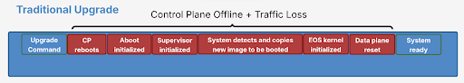
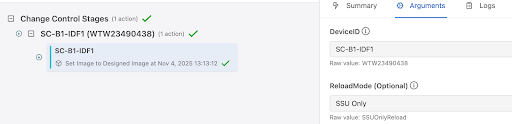
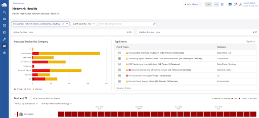

 

# Arista Southwest Region Newsletter

Welcome to the November 2025 newsletter for Arista customers in the U.S. Southwest Region!  

Did you hear? VeloCloud is now a part of Arista. Check out the latest blog, written by our CEO, Jayshree Ullal below!  
[Next Generation SD-WAN in the AI Era, by Arista CEO Jayshree Ullal](https://blogs.arista.com/blog/next-generation-sd-wan-in-the-ai-era)  

Check out additional Blog Posts below!  
[CloudVision: The First Decade](https://blogs.arista.com/blog/cloudvision-the-first-decade-2025)  
[All Blogs](https://blogs.arista.com/blog)  
 
We welcome your feedback on the newsletter. If you have any ideas on what you want to see, please reach out to southwest@arista.com.  

---

## **Unlocking Continuous Network Uptime: The Power of Arista SSU Hitless Upgrade**
By: Alex Bojko, Advanced Services Engineer  

The words "it's time to upgrade the network" can send shivers down even the most seasoned network engineers' spine. The term software upgrade is synonymous with network downtime in the realm of network engineering. Schedules must be adjusted, clients and customers alerted, and downtime, or planned outages, must be scheduled to complete these tedious procedures. Even a few seconds of downtime can have a real operational and financial impact on many organizations. For certain domains, like healthcare, network downtime is unacceptable.  

Arista aims to flip the script on software upgrades by delivering game-changing hitless upgrades that result in minimal to no packet loss and no impact to end users. Yes, you read that correctly, leveraging the power of Arista SSU (Smart System Upgrade), an EOS switch supporting Access Points, PC's, IP Phones, IP Cameras, and any other end device can undergo a software upgrade without any impact to client traffic.  

In this article, we will highlight how the hitless upgrade procedure works, and how you can complete the upgrade solely through CloudVision.   

SSU, or Arista's hitless upgrade, works by forwarding data plane traffic based on the last known state of the device's control plane as it appeared prior to the upgrade. All PoE (Power over Ethernet) devices connected to the switch will continue to receive power throughout the entirety of the upgrade. The below image depicts a comparison of what occurs during a normal software upgrade vs the Arista SSU hitless upgrade.   

<figure markdown="span">
  {: style="height:150px;width:700px"}
  <figcaption>Traditional Upgrade</figcaption>
</figure>  

<figure markdown="span">
  {: style="height:175px;width:700px"}
  <figcaption>SSU Smart System Upgrade</figcaption>
</figure>  

The only observed packet loss, if any, occurs during the sub-second timeframe where the device's control plane comes back online, and re-syncs with the data plane.  

SSU is the perfect solution for single-homed endpoints, which encompass the vast majority of campus end devices. These devices rely on a single connection to a switch for uptime, and with the introduction of SSU hitless upgrades, are now able to achieve continuous network uptime even during software upgrades. An access point, which can service hundreds of clients, can maintain power and internet connectivity while the access switch it's connected to undergoes a software upgrade. This is applicable to all access devices that service our network users.   

As mentioned above, hitless upgrades can be executed entirely through CloudVision using the Software Management Studio. Simply assign a new version of EOS to your Arista switch and submit the workspace. You can directly download the desired EOS image without ever leaving CloudVision. Downloading the image will make it accessible in CloudVIsion for the current and all future devices to use.  

After selecting the desired image and submitting the Workspace, within the Change Control tab, select the device, followed by the arguments tab, and under the "Reload-Mode" dropdown, select "SSU Only". This will instruct CloudVision to proceed with a hitless upgrade, as opposed to a standard software upgrade. The last step is the Approve and Execute the Change Control, and the device will begin the SSU process. You can view the logs associated with the change directly through the Change Control screen as well.   

<figure markdown="span">
  {: style="height:150px;width:700px"}
  <figcaption>SSU Smart System Upgrade</figcaption>
</figure>   

The Arista SSU Hitless upgrade is a game-changer for network engineers who once feared the task of completing  software upgrades. For more information on hitless upgrades, please click on the links below.   

[Tech Library: Hitless Upgrade](https://tech-library.arista.com/solution_guides/ssu/)  

---

## **A More Simple View of Network Metrics**
By: Akashdeep Takhar, Advanced Services Engineer, Southwest Region    

A more efficient approach to monitoring network traffic metrics not only helps in identifying issues in production, it can also lead to a significantly faster time to troubleshooting. Although the CLI is great at quickly gathering information, utilizing graphs and charts to visually represent that data allows for an illustrative way to measure network information. That’s where the Dashboards tool in CloudVision is ready to help.  

Dashboards give the ability for network data to be visually represented in graphs, charts, interactive menus, and customizable layouts. Rather than navigating across multiple devices, you can gather both summaries and in depth views of the entire network. CloudVision provinces pre-built Dashboards for you to view. However, in addition to that, you have the ability to become creative and customize these Dashboards to your liking. Let’s take a look at some examples of Dashboards.  

<figure markdown="span">
  
  <figcaption>Network Health Dashboard</figcaption>
</figure>  

In the example above, we have a dashboard that lists events that impact the health of the networks. The left hand horizontal bar chart works like this: the x-axis identifies a number of devices, the y-axis lists type of events that are harmful to given device, the colors of the bar categorize the event types as critical, error, or warning. By viewing this, we are informed that many devices in the network are exposed to potential harm. To further elaborate on those warning, take a look at the table located to the right.  

The table on the right lists the events and the message associated with that event. By looking at these two side by side, we now know of potential issues that are impactful to the device. Had that not been there, we would not be able to identify issues early on before scaling out the production for future use. At the bottom of the dashboard, we see a timeline of critical issues for the untagged devices, further providing us with information necessary to fix.  

<figure markdown="span">
  
  <figcaption>Device Power Consumption Dashboard</figcaption>
</figure>   

Another Dashboard that is pre-built into your CloudVision instance is the Device Power Consumption board. A method of analyzing devices for troubleshooting problems, could be to view this dashboard for an overall view of input and output wattage use. If you suspect that there are powers issues that are causing network disruptions, simply navigate to this page to see all the devices and their power consumption.  

In addition to the graph, the bar at the top labeled “devices device*” allows for you to view the metrics, specified for that particular device. In the case where you would prefer to view the power use of multiple devices, you can select those devices within the top drop down bar as well. The graphs readjust to the chosen device. Take a look below as we select a device:  

<figure markdown="span">
  
  <figcaption>Device Power Consumption Dashboard</figcaption>
</figure>  

These are examples of pre-built dashboards. CloudVision allows for you to also create a many customizable dashboard to specific metric views that are of interest to you. If you would like any assistance on how to begin this step, contact your ASE or SE to set up a meeting.  

For more information on dashboards in CloudVision, click the link below:  
[CloudVision Dashboard Guide](https://www.arista.io/help/articles/ZGFzaGJvYXJkcy5BbGwuZGFzaGJvYXJkcw==)   

---

## __*Upcoming Events*__  
Arista hosts various events throughout the year for you! Members of our team organize these informative events to showcase Arista's ability to not only help improve your network, but to also assist by providing a set of tools to improve your operations!  

Click on the boxes below to be directed to Arista's website for additional lists of Webinars and Events.

-   __Webinars__  

    --- 

    We make is easy for you to view products that are of interest, all virtually! Technical memebers of the team showcase outstading explanation of the products. Click below to see our list of Webinars. 

    [Arista Webinars](https://www.arista.com/en/company/news/webinars){.md-button}

-   __Events__ 

    ---
    Join us in person to get a closer look in our list of produts and solution, as well as get the chance to meet members of the team. Click below to see our list of ipcoming Events. 

    [Upcoming Events](https://www.arista.com/en/company/news/events){ .md-button }

--- 

## __*Software Updates*__
<figure markdown>
{: style="height:200px;width:300px"}    
    <figcaption></figcaption>
</figure>
For new code releases, click [here](https://www.arista.com/en/support/software-download) 

   |  Softwares    | Versions      |  Release Date |
   | :-----------: | :-----------: | :-----------:
   | __EOS__           | 4.34.3.1M  4.32.8M   4.34.3M   4.35.0F    | November 4th, 2025  October 27th, 2025   October 6th, 2025   October 6th, 2025   
   | __CVP__           | Portal 2025.2.1   Appliance 7.0.1   Sensor 1.2.0      | August 21st, 2025   January 28th, 2025  September 8th, 2025  
   | __DMF__           | 8.8.0  | August 15th, 2025   
   | __WLAN__  CV-CUE  |   19.0.0        |   July 25th, 2025   
   | __Arista NDR__         | 5.3.5         | July 16th, 2025
   | __TerminAttr__    | 1.39.1         | July 18th, 2025    
   | __VeloCloud SD-WAN__   Orchestrator/ Gateway / Edge   |  6.4.0         |   May 2nd, 2025   

---

## __*Software Advisories*__
Below is a list of advisories that are announced by Arista. To view more details on the specific advisories, please click the links in the middle row.

| Name          | Advisory Link           | Date of Advisory Notice  |
| :-----------: |:-------------:| :-----:|
|  __Arista DANZ Monitoring Fabric__   | [Security Advisory 0124](https://www.arista.com/en/support/advisories-notices/security-advisory/22538-security-advisory-0124)  | October 22nd, 2025   |  
|  __Arista Edge Threat Management NGFW__   | [Security Advisory 0123](https://www.arista.com/en/support/advisories-notices/security-advisory/22535-security-advisory-0123)  | October 21st, 2025   |  
|  __WiFi 7 Access Points Firmware Version 21.0__   | [Field Notice 0117](https://www.arista.com/en/support/advisories-notices/field-notice/22534-field-notice-0117)  | October 16th, 2025   |  
|  __SwitchApp Interfaces starting with EOS 4.35.0F__   | [Field Notice 0116](https://www.arista.com/en/support/advisories-notices/field-notice/22528-field-notice-0116)  | October 14th, 2025   |  

 

For a list of the most current advisories and notices, click [Here](https://www.arista.com/en/support/advisories-notices)

---

## __*Product Updates*__
<figure markdown>
{: style="height:200px;width:400px"}   
    <figcaption></figcaption>
</figure>
**End of Sale** notices are listed below.

| Device        | Name           | End Of Sale Date  |
| :-----------: |:-------------: |     :----:        |
| Software      | [End of Software for CloudVision Portal 2023.2](https://www.arista.com/en/support/advisories-notices/end-of-support/21412-end-of-software-support-for-cloudvision-portal-2023-2-release-train) [End of Software Support for EOS 4.28](https://www.arista.com/en/support/advisories-notices/end-of-support/21275-end-of-software-support-for-eos-4-28) [DMF and CCF Deployments on Accton/ Edgecore Switches](https://www.arista.com/en/support/advisories-notices/end-of-support/21094-end-of-support-for-dmf-and-ccf-deployments-on-accton-edgecore-switches) [EOS-4.34 and later no longer supported on select switches](https://www.arista.com/en/support/advisories-notices/end-of-support/21089-end-of-software-support-for-7280r-r2-7500r-r2-and-7020r-series)  | May 27th. 2025   March 14, 2025  January 31st, 2025  January 15th, 2025   |
| CVP           | [CVP IPAM Application](https://www.arista.com/en/support/advisories-notices/endofsupport)   [CVP 2023.3](https://www.arista.com/en/support/advisories-notices/end-of-support/21627-end-of-software-support-for-cloudvision-portal-2023-3-release-train)          |  July 14th, 2025   June 17th, 2025   |
| DMF           | [DMF Service Node DCA-DM-SC2](https://www.arista.com/en/support/advisories-notices/end-of-sale/22537-end-of-sale-end-of-life-for-arista-service-node-appliance-dca-dm-sc2)          |  October 22nd, 2025           |  
| CCF           | [CCF Product Line](https://www.arista.com/en/support/advisories-notices/end-of-sale/22430-end-of-sale-end-of-life-for-arista-ccf-product-line)          |  October 1st, 2025           |  
| Switches      | [7010TX-48-DC Switch](https://www.arista.com/en/support/advisories-notices/end-of-sale/22421-end-of-sale-of-the-arista-7010tx-48-dc-switches)  [7050CX3-32S Switch](https://www.arista.com/en/support/advisories-notices/end-of-sale/22419-end-of-sale-of-the-arista-7050cx3-32s-switches)  [CCS-720XP-96ZC2 Switch with 4GB DRAM](https://www.arista.com/en/support/advisories-notices/end-of-sale/22403-end-of-sale-of-the-arista-ccs-720xp-96zc2-switches-with-4gb-dram)  [CCS-720D Switches with 4GB DRAM](https://www.arista.com/en/support/advisories-notices/end-of-sale/22402-end-of-sale-of-the-arista-ccs-720d-switches-with-4gb-dram)  [CCS-710P-12 Switch](https://www.arista.com/en/support/advisories-notices/end-of-sale/22401-end-of-sale-of-the-arista-ccs-710p-12-switch) |  September 19th, 2025  September 19th, 2025  Septemebr 12th, 2025  September 12th, 2025  September 12th, 2025 |
| Access Points      | [AP Mounts](https://www.arista.com/en/support/advisories-notices/end-of-sale/22536-end-of-sale-of-ap-mounts-mnt-ap-flat-c130-mnt-ap-flat-c100-mnt-ap-flat-14cm-a)  |  October 22nd, 2025   | 
| VeloCloud      | [SASE Secured by Symantec](https://www.arista.com/en/support/advisories-notices/end-of-sale/22072-end-of-sale-life-velocloud-sase-secured-symantec)  [Software Defined (SD) Access](https://www.arista.com/en/support/advisories-notices/end-of-sale/21653-end-of-sale-end-of-life-for-velocloud-software-defined-sd-access)   |  August 20th, 2024   July 1st, 2025 | 

**New Releases** of Arista's device are listed below 

|  Device       | More Information |  Release Date 
    | :-----------: | :-----------:    | :-----------:
    | Arista VeloCloud | [VeloCloud Acquisition](https://www.arista.com/en/company/news/press-release/21646-pr-07012025) | Q3 2025
    |  Arista SWAG    |   [Modern Stacking for Campus](https://www.arista.com/en/company/news/press-release/20693-pr-12032024)                | Q1 2025 
    | Arista Multi-Domain Segmentaton Service  | [Arista MSS](https://www.arista.com/en/company/news/press-release/19297-pr-20240430)         | Q3 2024
    | Arista CV UNO  | [CloudVision Universal Network Observability](https://www.arista.com/en/company/news/press-release/19195-pr-20240305)  | Q1 2024

---
# *Feel Free to Reach Out To Us For Your Network Needs* 
<figure markdown>
{: style="height:300px;width:800px"}  
    <figcaption></figcaption>
</figure>
We thank you for taking the time to read out newsletter today. Feel free to reach out to your SE or ASE for more information or questions regardsing your network operations. Until next month, have a good one! 

