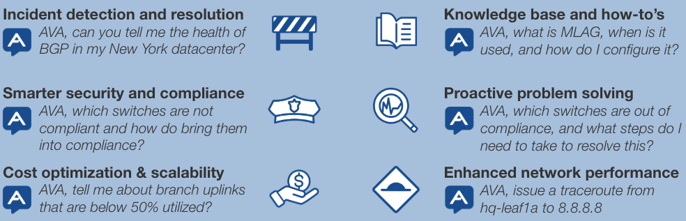
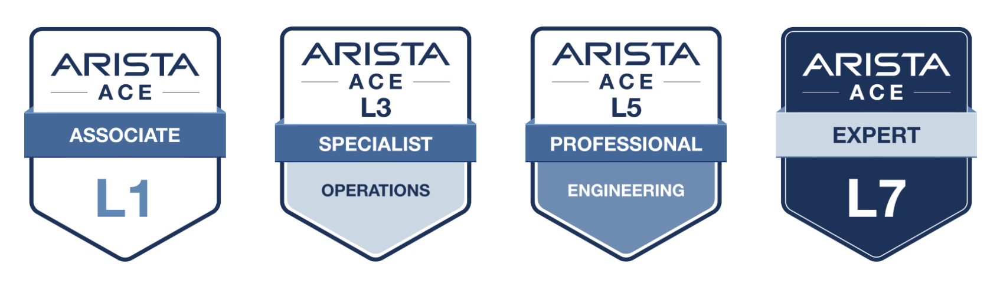

# Arista Southwest Region Newsletter

Welcome to the March 2026 Newsletter for Arista customers in the U.S. Southwest Region! 

We welcome your feedback on the newsletter. If you have any ideas or suggestions on how to improve the newsletter, please reach out to [southwest@arista.com](mailto:southwest@arista.com){: target="_blank" }.  

---

## Leadership Perspectives — Recent Blogs from Arista Leaderships

-   **Powering AI Centers with AI Spines**
    ---
    *Feb 12, 2026: Arista is pioneering the new era of AI Centers with the 7800R4. Hear from Arista CEO Jayshree Ullal about how a centralized AI Spine simplifies operations across massive 400G/800G/1.6T Etherlink fabrics.*
    
    [Read Blog](https://blogs.arista.com/blog/powering-ai-centers-with-ai-spines){: target="_blank" }

-   **Delivering Reliable AI and Cloud Networking**
    ---
    *Dec 18, 2025: Hugh Holbrook and Kamal Sharma explore the infrastructure requirements for massive-scale GenAI.*
    
    [Read Blog](https://blogs.arista.com/blog/delivering-reliable-ai-and-cloud-networking){: target="_blank" }

[Explore All Blogs](https://blogs.arista.com/blog){: target="_blank" }

---

## Southwest Region Tech Tip of the Month

!!! info "Documentation at Your Fingertips: The CloudVision Help Center"
    

    Stop hunting for outdated PDFs! The **CloudVision Help Center** (accessible via the `?` icon in the top right of the CVaaS UI) is a live, searchable repository containing information related to all aspects of CloudVision, from Provisioning to Events to Streaming Telemetry. 
    
    **Why it matters:** Unlike static manuals, the Help Center is updated in real-time alongside CloudVision releases. Whether you are looking for specific Studio syntax, Resource API calls, or Hardware replacement workflows, it provides context-aware documentation that matches the version you are currently running.
    
    **Pro Tip:** Clicking on the question mark will open help center documentation relevant to the current tab and page you are viewing in CloudVision. If you have a question on a specific area, navigate to it in CloudVision and then select the question mark icon to view information about that topic.
    

  

---
## Featured Articles

### Ask AVA: Your CloudVision Co-Pilot
By: Alex Bojko, Advisory Systems Engineer 
 

When a network issue arises, what is the first step you take? Logically, it would make sense to gather as much data as possible to determine exactly what is going wrong. You hunt for answers: What does the mac-address table look like? What about the routing table? Can I ping an endpoint? Where along the path is the issue occurring? 

The answer to all of these questions requires data. This data needs to be pulled from the device(s) impacted by the network issue at hand.

 
**A Foundation of High-Quality Data**

When Arista EOS was first created, it revolutionized network operating systems by implementing a publish-and-subscribe architecture. By holding all device data in a system database (SysDB) independent of the processing itself, we changed how switches operate under the hood.

This has since evolved from SysDB, state data from a single device, to Network Data Lake (NetDL), encompassing data from all network domains. With NetDL, we can aggregate data from our network infrastructure, virtual infrastructure, wireless, security, IoT, and 3rd party devices in a centralized series of databases. This provides us with real-time, accurate, relevant, high quality data from our entire network.

<figure markdown="span">
  
  <figcaption>NetDL - Network Data Lake</figcaption>
</figure> 

 

Arista CloudVision further enables the utilization of that data by aggregating it into a management and network orchestration interface accessible by the end user, with changes visible in real time thanks to streaming telemetry.

 
 
**Introducing Ask AVA**

Today, networks are further evolving, with AI (Artificial Intelligence) leading the way. However, AI is only as powerful as the quality of data it's learning from. If we feed an AI system with poor data, we can expect nothing but poor output in return. 

With NetDL, Arista offers a centralized data store containing high quality data relevant to your network. This is a game changer for creating a powerful, accurate AI interface. 

Ask AVA, Arista's very own conversational AI interface, is built into CloudVision, and designed to be the ultimate co-pilot of every network engineer. Unlike generic AI chatbots, Ask AVA is purpose built for networking and learns from a vast foundation of high quality data courtesy of NetDL.
   

Ask AVA changes the dynamic from "hunting for answers" to simply "asking for answers". 

Imagine an AI that can learn from data found across all domains of your network, that knows which devices are within your data center or across your many campuses, that can help you troubleshoot network issues as they arise, or serve as your network consultant and point you towards relevant documentation.  

Ask AVA is currently a beta feature that can be enabled in the Settings > Features tab, as seen in the image below.

 

<figure markdown="span">
  
  <figcaption>CloudVision - Settings & Features Tab</figcaption>
</figure>  

 

**Current Capabilities of Ask AVA**

Ask AVA acts as your AI co-pilot for network operations, streamlining complex workflows into simple conversational queries. Instead of clicking through multiple dashboards, you can instantly query for real-time insights, run diagnostics, and locate documentation. Here is a look at what Ask AVA can do for you today (and this is only the start):

| Capability Category | Supported Actions |
| :--- | :--- |
| **Network Data Retrieval** | <ul><li>Search and filter network events by severity, time range, and device criteria</li><li>Query endpoint information and connection details</li><li>Retrieve device compliance and bug exposure data</li></ul> |
| **Network Troubleshooting** | <ul><li>Run read-only EOS CLI commands to view device outputs</li><li>Run ping tests from specified devices to target hosts</li><li>Perform traceroute analysis from source devices to destinations</li></ul> |
| **Data Visualization** | <ul><li>Generate device and interface metric visualizations (CPU, memory, etc.)</li></ul> |
| **Knowledge Base Access** | <ul><li>Search CloudVision Help Center articles</li><li>Retrieve relevant documentation based on user queries</li></ul> |

 

**Try Ask AVA Today**

Once enabled, you can start using the Ask AVA beta feature in your CVaaS (CloudVision as a Service) tenant today. Not only can Ask AVA assist you in troubleshooting network issues, it can also provide you with help answering design or implementation questions while providing you with CloudVision help center documentation as a reference.  

 

<figure markdown="span">
  
  <figcaption>Example of Ask AVA Conversational Output  </figcaption>
</figure> 

Speak to your local account team about the capabilities of Ask AVA—we welcome any and all feedback!

To learn more about Ask AVA, click on the link below. 

* [Ask AVA Overview](https://www.arista.io/help/articles/overview-core-tools-ask-ava ){ target="_blank" }

---
 
###Leveraging Arista’s POC (Proof of Concept) Lab to Assist New and Existing Customers
By: Shayne Kelly, Advisory Systems Engineer
 

**Introduction**

Arista Networks has a well developed and outstanding POC LAB that has helped many customers, both new customers and existing customers, test out features and designs in order to make their network perform at its best. New customers can leverage POCs to see how Arista’s UCN would allow their Campus, Data Center or WAN environments to operate with a modern and proven approach, incorporating new features and hardware. Existing customers can leverage POCs to test out an upcoming migration or new features that they are looking to apply to their environment. In both cases, leveraging the lab and the expertise of the POC and Customer Engineering Teams, allows the customer to see, first hand, the benefits that Arista can bring to their projects. 

 

**Types of Arista POCs**

While there are many different POCs that are conducted all the time, there are (4) main categories of POCs that are used most often. The first (3) have established architectural designs and test plans, while the 4th provides the ability to customize your POC based upon the features and capabilities that you intend to test. 

### Available Proof of Concept (POC) Tracks

| POC Track | Architecture & Overview | Key Features & Use Cases |
| :--- | :--- | :--- |
| **Data Center Standard** | Leverages a Layer 3 Leaf-Spine architecture using EVPN. Uses various hardware models to showcase platform strengths and recommended deployment architectures. | <ul><li>EVPN, MLAG, and QoS</li><li>SSU and hitless reload</li><li>DCI, AVD, and Automation Models</li><li>CloudVision, Telemetry, DMF, and MSS</li></ul> |
| **Campus Standard** | Leverages a Layer 2 or Layer 3 Leaf-Spine architecture. Incorporates Arista Access Points to demonstrate a complete, end-to-end campus deployment. | <ul><li>802.1X (Dot1X) and Campus QoS</li><li>Phone and IoT-specific features</li><li>Arista AGNI and 3rd-party NAC (Forescout, ISE, ClearPass)</li><li>Wi-Fi integrations and CV-CUE</li></ul> |
| **WAN Standard** | Focuses on deploying modern WAN and SD-WAN edge and transit routing technologies with a well-developed test plan. | <ul><li>MPLS and Segment Routing (SR)</li><li>VeloCloud and SD-WAN integration</li></ul> |
| **SE-Led** | Highly customized tracks driven by specific customer use cases. Topology, hardware, and test plans are developed by the CE Team alongside the customer. | <ul><li>Testing complex network migrations</li><li>Displaying newly developed EOS features</li><li>Showcasing interoperability with existing tech</li></ul> |

Besides these, there are a myriad of standard and custom POCs that can be completed. For example, we have POCs for Arista’s monitoring solution (DMF) (Link) and custom POCs that are done to display new architectures such as Arista new WiFi Architecture VESPA (Link). Your local account team is happy to discuss how best to deliver a POC that will help to showcase and test the exact features and scenarios you are wanting to see. 

 

**A Brief Example of Using Custom POCs to Test New Architectures**

Recently I completed a POC for a customer that wanted to test how best to migrate away from a very large Layer 2 Leaf-Spine design to a new Layer 3 Leaf-Spine Architecture, leveraging EVPN. The customer had very specific requirements for this migration.  In order to ensure accuracy and mimic what we might expect to see during their migration, we curated the POC to include specific hardware platforms, versions of code, and traffic patterns.

 

**Some of the highlights of this POC include:**

* **High-Capacity Hardware:** Multiple chassis-based switches, using 100G and 400G line cards for connectivity.
* **Massive Host Scale:** A very large scale of end hosts (upwards of 15,000) that were modeled using traffic generators (IXIA).
* **Complex Routing:** A very large route scale with particular route policies to control traffic in and out of the Data Center Fabric.
* **Customized Testing:** A very unique test plan that was based upon the customer’s environment and requirements for the change.

We leveraged the traffic generators and Arista’s CloudVision to model these changes and then show the impact of each step of this migration in terms of disruption to the traffic patterns. This allowed the customer to inform their other infrastructure teams about what to expect at each step of the migration. This type of preparation was key for them to feel comfortable with this change and be prepared to undertake this in a production environment. 

 

**Summary**

POCs can be a great way to get exposure to new technologies and solutions, to test out new features and even to gain an insight into areas of the network where Arista and the UCN architecture can greatly improve your network performance. Once the POC is ready for testing, you can attend, by visiting our Headquarters, or you can view remotely, leveraging either Zoom and Video conferencing solutions, or even by using a VPN to gain access to the Switches and Management Platforms that are being used. Your local account team will take care of all the details and do all the leg work needed to get the POC up and running. Then you get to sit back and see the magic happen. 

---

## __*Upcoming Events*__  
Arista hosts various events throughout the year for you! Members of our team organize these informative events to showcase Arista's ability to not only help improve your network, but to also assist by providing a set of tools to improve your operations!  

Click on the boxes below to be directed to Arista's website for additional lists of Webinars and Events.

-   __Webinars__  

    --- 

    We make it easy for you to view products that are of interest, all virtually! Technical members of the team showcase outstanding explanations of the products. Click below to see our list of Webinars. 

    [Arista Webinars](https://www.arista.com/en/company/news/webinars){.md-button target="_blank"}

-   __Events__ 

    ---
    Join us in person to get a closer look at our list of products and solutions, as well as get the chance to meet members of the team. Click below to see our list of upcoming Events. 

    [Upcoming Events](https://www.arista.com/en/company/news/events){ .md-button target="_blank" }

--- 

## __*Software Updates*__

*Stay informed on the latest software updates across all Arista products and services.*

|  Software    | Version      |  Release Date |
| :-----------: | :-----------: | :-----------: |
| __EOS__           | 4.23.10M   4.34.5M   4.33.7M   4.35.2F | March 2nd, 2026   February 25th, 2026   February 24th, 2026   February 17th, 2026 |
| __CVP__           | Portal 2025.3.2   Appliance 7.1.0   Sensor 1.3.0 | February 12th, 2026   September 2nd, 2025   December 5th, 2025 |
| __DMF__           | 8.9.0 | February 13th, 2026 |
| __CV-CUE__         | 21.0.0 | January 16th, 2026 |
| __Arista NDR__     | 5.3.5 | July 16th, 2025 |
| __TerminAttr__     | 1.42.1 | February 4th, 2026 |
| __VeloCloud SD-WAN__  Orchestrator/Gateway/Edge | 6.4.1 | December 19th, 2025 |

[View All Latest Software Updates](https://www.arista.com/en/support/software-download){: .md-button .md-button--primary target="_blank" }

---

## __* Security Advisories and Field Notices*__

*Stay informed on the latest platform security and field notice updates.*

### **Security Advisories**
* **Hardware IPSec** — [Security Advisory 0134](https://www.arista.com/en/support/advisories-notices/security-advisory/23419-security-advisory-0134){: target="_blank" }   *(February 17th, 2026)*
* **ETM NGFW** — [Security Advisory 0133](https://www.arista.com/en/support/advisories-notices/security-advisory/23399-security-advisory-0133){: target="_blank" }   *(February 3rd, 2026)*

### **Field Notices**
* **CV-CUE: Depreciation of IAPC via Wireless Manager** — [Field Notice 0124](https://www.arista.com/en/support/advisories-notices/field-notice/23398-field-notice-0124){: target="_blank" }   *(February 3rd, 2026)*
* **CV-CUE: Depreciation of Probed SSID** — [Field Notice 0123](https://www.arista.com/en/support/advisories-notices/field-notice/23397-field-notice-0123){: target="_blank" }   *(February 3rd, 2026)*

 

[View All Latest Advisories & Notices](https://www.arista.com/en/support/advisories-notices){: .md-button .md-button--primary target="_blank" }

---

## __* Product Updates*__

*Stay up to date on all new Arista Product Releases, as well as End of Sale/End of Support Notices.*

### **New Product Releases** 
* **Q1 2026** — [Ask AVA - CloudVision as a Service (beta feature)](https://www.arista.io/help/articles/overview-core-tools-ask-ava){: target="_blank" }

###  **End of Sale / End of Software Support**
* **February 18th, 2026** — [DMF Node DCA-DM-AN450](https://www.arista.com/en/support/advisories-notices/end-of-sale/23436-end-of-sale-end-of-life-for-arista-analytics-node-appliance-dca-dm-an450){: target="_blank" } 
* **February 18th, 2026** — [DMF Node DCA-DM-C450](https://www.arista.com/en/support/advisories-notices/end-of-sale/23435-end-of-sale-end-of-life-for-arista-dmf-controller-appliance-dca-dm-c450){: target="_blank" } 
* **February 2nd, 2026** — [CloudVision Portal 2024.2](https://www.arista.com/en/support/advisories-notices/end-of-support/23396-end-of-software-support-for-cloudvision-portal-2024-2-release-train){: target="_blank" } 

 

[View All Latest End of Sale & Support Notices](https://www.arista.com/en/support/advisories-notices/endofsale){: .md-button .md-button--primary target="_blank" }

---

## Have you heard? 
Arista has revamped their certifications! The new **Arista Certified Engineer (ACE)** program is now organized by specific tracks like Cloud Data Center, Campus, and Automation to better align with your job role.

[Start your ACE journey now](https://www.training.arista.com/){ .md-button .md-button--primary target="_blank" }

---

---
## *Your Southwest Regional Team is Here to Support Your Success.* 

---

  <h3 style="color: #004a99; margin-top: 0;">Let's Connect</h3>
  
Thanks for reading! Your local Arista team is here to help you navigate your evolving network needs. Reach out anytime to southwest@arista.com for more information or technical guidance. Until next month—stay connected!

  <a href="mailto:southwest@arista.com" class="md-button md-button--primary">Contact Your Local Team</a>

