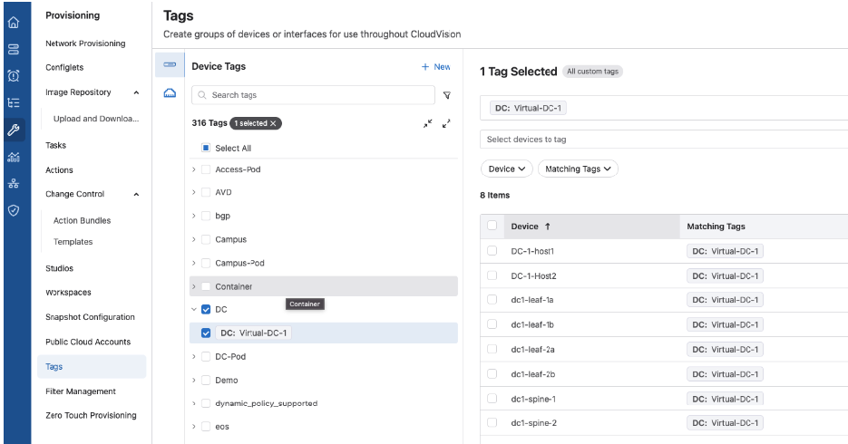
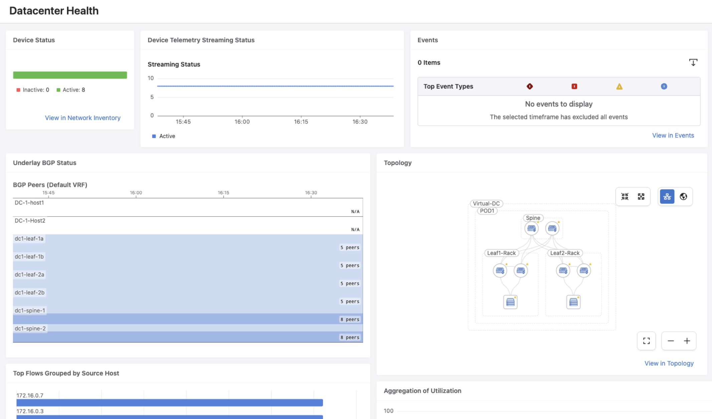
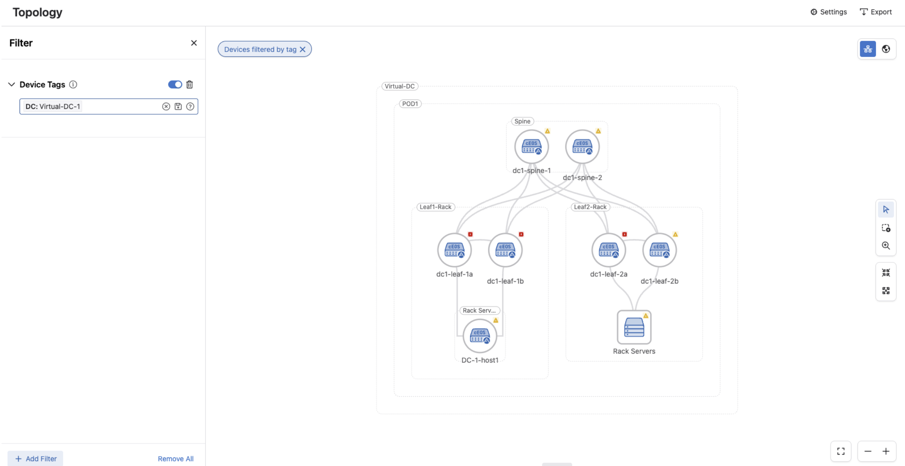
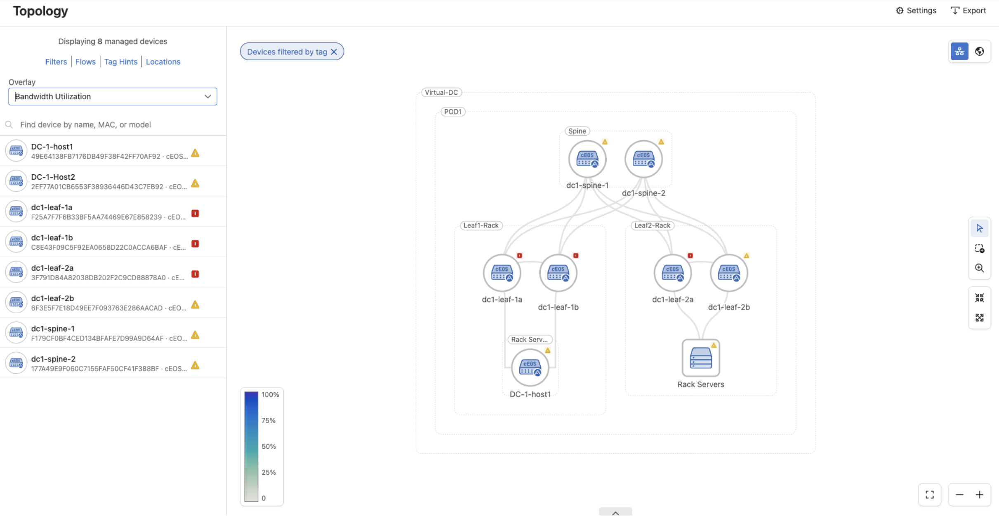
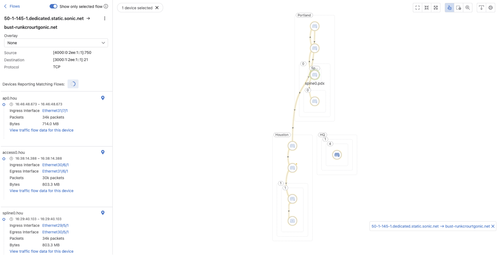
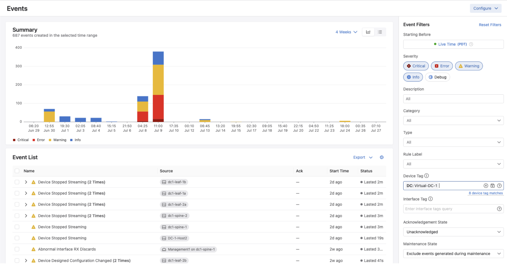
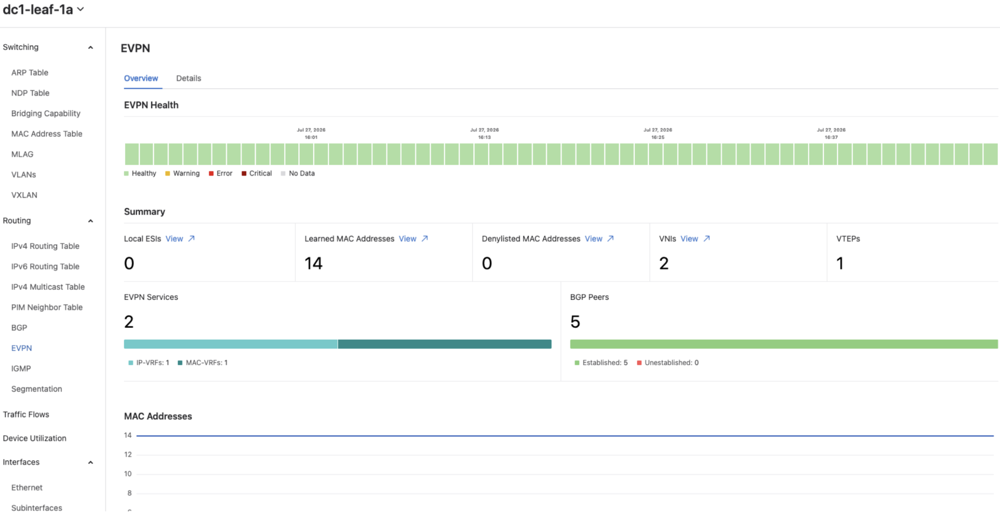
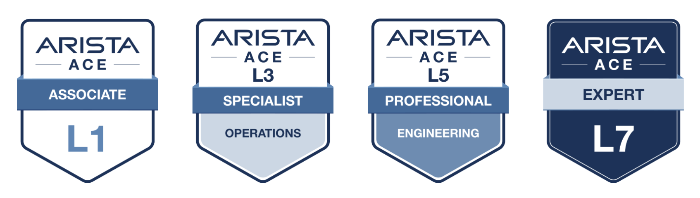

# Arista Southwest Region Newsletter

Welcome to the August 2026 Newsletter for Arista customers in the U.S. Southwest Region! 

We welcome your feedback on the newsletter. If you have any ideas or suggestions on how to improve the newsletter, please reach out to [southwest@arista.com](mailto:southwest@arista.com){: target="_blank" }.  

---

## Leadership Perspectives — Recent Blogs from Arista Leadership

-   **The Unified Edge for a Secure Branch**
    ---
    *Jul 21st, 2026: Brendan Gibbs explains how modernizing branch networks requires eliminating "box sprawl" by converging SD-WAN, security, LAN, and Wi-Fi into a unified, AI-driven platform.*
    
    [Read Blog](https://blogs.arista.com/blog/the-unified-edge-for-a-secure-branch){: target="_blank" }

-   **Three Genius Ideas for AI Fabrics**
    ---
    *June 9th, 2026: Kenneth Duda and Alan Judge detail how multi-planar leaf-spine networks, Multipath Reliable Connection (MRC), and SRv6 are transforming scale-out AI fabrics. Together, these three innovations provide massive scale, superior load balancing, and seamless resilience for the world's most advanced AI infrastructures.*
    
    [Read Blog](https://blogs.arista.com/blog/three-genius-ideas-for-ai-fabrics){: target="_blank" }

[Explore All Blogs](https://blogs.arista.com/blog){: target="_blank" }

---

## Southwest Region Tech Tip of the Quarter

!!! info "Your new network colleague: Ask AVA"
    

    Tired of clicking through multiple dashboards to piece together a troubleshooting picture? 
    
    Meet **Ask AVA**, your new CloudVision AI colleague that allows you to interact with your network using natural language.
    
    **Why it matters:** Ask AVA leverages your high-quality data in Arista's Network Data Lake (NetDL) to answer specific questions about your network. Instead of manually correlating MAC addresses and routing tables across different screens, you can simply ask AVA to summarize active network events, generate CPU and memory visualizations, or even run `ping` and `traceroute` commands directly from impacted devices.
    
    **Pro Tip:** You can enable Ask AVA (currently in Beta) by navigating to the **Settings > Features** tab in your CVaaS tenant. Once enabled, click the **"A"** icon in the top right corner of any CloudVision screen to open the chat interface. If you are logging in after a long weekend, try starting with: "Create a list of Events that have occured over the last 24 hours and recommend which events I should address first."

    Check out last months Newsletter to learn more about Ask AVA! To view, select "March 2026" in the top left navigation menu.
    

---
## Featured Articles

###  Troubleshooting BGP EVPN VxLAN Issues With CloudVision
By: Murthy Devarakonda, Manager, Systems Engineering
 

Deploying a datacenter or campus network fabric using BGP and EVPN VxLAN can be simplified by utilizing features like CloudVision Studios or the Arista AVD data model. These tools can dramatically accelerate deployment times, shifting timelines from days to hours. The process involves gathering essential fabric details—such as BGP ASN numbers, IP addresses, VRFs, and VLANs—and inputting them into either CloudVision Studios or AVD to output Arista validated configurations for large-scale deployment.

Once deployment is finished, the primary objective shifts to empowering your operations team. By leveraging CloudVision, they can resolve network issues efficiently and manage incremental updates effectively. To help minimize the mean-time-to-repair (MTTR), consider implementing the following strategy: organize devices using distinct tags to streamline and focus troubleshooting activities. A visual example of this setup is available in the screen below.

 

<figure markdown="span">
  
  <figcaption>CloudVision Tags Example</figcaption>
</figure> 

 

CloudVision serves as a single pane of glass for all network state and telemetry, which your operations team can fully leverage. By creating a custom dashboard to monitor critical KPIs and setting it as their default landing page, the team can easily evaluate overall network health. From this central dashboard, operations can drill down further into the various sections of CloudVision.

 

<figure markdown="span">
  
  <figcaption>CloudVision Data Center Health Telemetry Dashboard</figcaption>
</figure> 

 

To begin the troubleshooting process, navigate to the topology view. You can narrow down the focus area by utilizing the device tags created earlier: click on Filters → Add Filters → Device Tags. An example of this view is shown in the screenshot below.

 

<figure markdown="span">
  
  <figcaption>CloudVision Topology View - Device Tag Filter</figcaption>
</figure> 

 

Within this topology view, you can overlay the following details to assist with troubleshooting:

* **Active Events:** Displays real-time events for each device in the topology.
* **Bandwidth Utilization:** Highlights link bandwidth usage via a heatmap, where clicking an individual link displays its exact numerical values.
* **Discard Rates:** Details the packet discard rates across all network links using a heatmap, with link-specific rates available upon clicking.
* **Error Rate:** Illustrates link error rates through a heatmap, allowing you to click any link to view its specific error rate.
* **Operational Status:** Indicates the current operational state of network links.
* **Traffic Throughput:** Outlines the traffic throughput metrics for each individual link.

 

<figure markdown="span">
  
  <figcaption>CloudVision Topology View - Bandwidth Utilization Overlay</figcaption>
</figure> 

 

The end-to-end path of network traffic can be traced using the topology view's traffic flow animations. Operations teams can utilize this data to spot potential flow anomalies and confirm ideal paths.

 

<figure markdown="span">
  
  <figcaption>CloudVision Topology View - End to End Traffic Flow</figcaption>
</figure> 

 

By moving from the active event overlay into the Events section of CloudVision, you can access comprehensive details on various network events. In this view, you can filter events using specific conditions and adjust the time horizon to zero in on relevant alerts. Additionally, applying tags helps narrow your focus to a particular network, streamlining the path to root cause identification.

 

<figure markdown="span">
  
  <figcaption>CloudVision Events Summary</figcaption>
</figure> 

 

Ultimately, to pinpoint network problems right at the device level, you can make use of the interface counter and EVPN details provided on each device's specific page.

 

<figure markdown="span">
  
  <figcaption>CloudVision EVPN Dashboard</figcaption>
</figure> 

 

For a detailed demonstration of this workflow, please reach out to your Arista account team.

To learn more about any of the CloudVision concepts covered in this article, click the link below:

* [Arista CloudVision](https://www.arista.io/help/articles/overview-cloudvision ){ target="_blank" }

---
 

## __*Upcoming Events*__  
Arista hosts various events throughout the year for you! Members of our team organize these informative events to showcase Arista's ability to not only help improve your network, but to also assist by providing a set of tools to improve your operations!  

Click on the boxes below to be directed to Arista's website for additional lists of Webinars and Events.

-   __Webinars__  

    --- 

    We make it easy for you to view products that are of interest, all virtually! Technical members of the team showcase outstanding explanations of the products. Click below to see our list of Webinars. 

    [Arista Webinars](https://www.arista.com/en/company/news/webinars){.md-button target="_blank"}

-   __Events__ 

    ---
    Join us in person to get a closer look at our list of products and solutions, as well as get the chance to meet members of the team. Click below to see our list of upcoming Events. 

    [Upcoming Events](https://www.arista.com/en/company/news/events){ .md-button target="_blank" }

--- 

## __*Software Updates*__

*Stay informed on the latest software updates across all Arista products and services.*

|  Software    | Version      |  Release Date |
| :-----------: | :-----------: | :-----------: |
| __EOS__           | 4.35.6M   4.34.8M   4.33.10M   4.36.2F | August 18th, 2026   August 18th, 2026   August 18th, 2026   August 15th, 2026 |
| __CVP__           | Portal 2026.2.0   Appliance 7.2.0   Sensor 1.4.2 | June 23rd, 2026   July 2nd, 2026   July 8th, 2026 |
| __DMF__           | 8.10.0 | April 22nd, 2026 |
| __CV-CUE__         | 2026.2.0 | May 21st, 2026 |
| __Arista NDR__     | 5.3.5 | July 16th, 2025 |
| __TerminAttr__     | 1.45.1 | July 10th, 2026 |
| __VeloCloud SD-WAN__  Orchestrator/Gateway/Edge | 7.0.0 | July 2026 |

[View All Latest Software Updates](https://www.arista.com/en/support/software-download){: .md-button .md-button--primary target="_blank" }

---

## __* Security Advisories and Field Notices*__

*Stay informed on the latest platform security and field notice updates. For more information on Arista's statement on AI-Enhanced Security and Resilience regarding Mythos and project Glasswing, [click here.](https://www.arista.com/assets/data/pdf/glasswing/QA-Project-Mythos-Glasswing.pdf){: target="_blank" }*

### **Security Advisories**
* **VeloCloud Orchestrator SQL Injection** — [Security Advisory 0145](https://www.arista.com/en/support/advisories-notices/security-advisory/24365-security-advisory-0145){: target="_blank" }   *(July 27th, 2026)*
* **VeloCloud Orchestrator On-Prem Privileged Escalation** — [Security Advisory 0144](https://www.arista.com/en/support/advisories-notices/security-advisory/24364-security-advisory-0144){: target="_blank" }   *(July 27th, 2026)*

### **Field Notices**
* **Deprecation of EOS SWAG rpr Redundancy Mode** — [Field Notice 134](https://www.arista.com/en/support/advisories-notices/field-notice/24450-field-notice-0134){: target="_blank" }   *(August 18th, 2026)*
* **CloudVision Cluster Replay CLI Commands** — [Field Notice 133](https://www.arista.com/en/support/advisories-notices/field-notice/24406-field-notice-0133){: target="_blank" }   *(August 6th, 2026)*

 

[View All of the Latest Advisories & Notices](https://www.arista.com/en/support/advisories-notices){: .md-button .md-button--primary target="_blank" }

---

## __* Product Updates*__

*Stay up to date on all new Arista Product Releases, as well as End of Sale/End of Support Notices.*

### **New Product Releases** * **Q1 2026** — [Ask AVA - CloudVision as a Service (beta feature)](https://www.arista.io/help/articles/overview-core-tools-ask-ava){: target="_blank" }

###  **End of Sale / End of Software Support**
* **August 18th, 2026** — [DCA-AGNI-100](https://www.arista.com/en/support/advisories-notices/end-of-sale/24498-end-of-sale-notice-of-dca-agni-100){: target="_blank" }
* **August 13th, 2026** — [DCA-NDR-NCC10](https://www.arista.com/en/support/advisories-notices/end-of-sale/24449-end-of-sale-of-the-arista-dca-ndr-ncc10){: target="_blank" }
* **August 3rd, 2026** — [DCS-7060DX5-32](https://www.arista.com/en/support/advisories-notices/end-of-sale/24369-end-of-sale-of-the-arista-dcs-7060dx5-32-model-of-the-7060x5-series){: target="_blank" }
* **August 3rd, 2026** — [DCS-7060CX5-56D8](https://www.arista.com/en/support/advisories-notices/end-of-sale/24368-end-of-sale-of-the-arista-dcs-7060cx5-56d8-model-of-the-7060x5-series){: target="_blank" }

 

[View All Latest End of Sale & Support Notices](https://www.arista.com/en/support/advisories-notices/endofsale){: .md-button .md-button--primary target="_blank" }

---

## Did You Know? 
Arista has revamped their certifications! The new **Arista Certified Engineer (ACE)** program is now organized by specific tracks like Cloud Data Center, Campus, and Automation to better align with your job role.

[Start your ACE journey now](https://www.training.arista.com/){ .md-button .md-button--primary target="_blank" }

---

---
## *Your Southwest Regional Team is Here to Support Your Success.* 

---

  <h3 style="color: #004a99; margin-top: 0;">Let's Connect</h3>
  
Thanks for reading! Your local Arista team is here to help you navigate your evolving network needs. Reach out anytime to southwest@arista.com for more information or technical guidance. Until next month—stay connected!

  <a href="mailto:southwest@arista.com" class="md-button md-button--primary">Contact Your Local Team</a>

